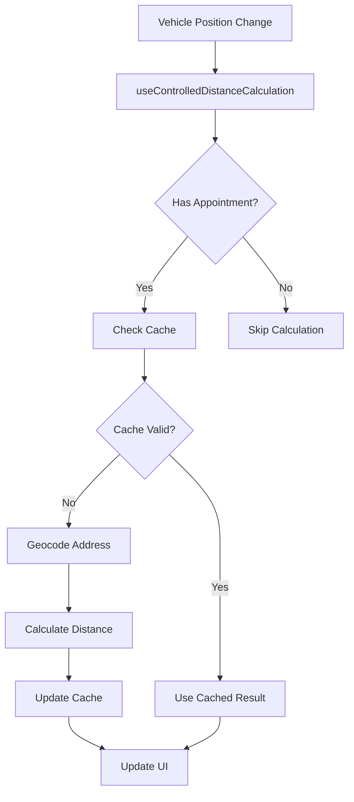
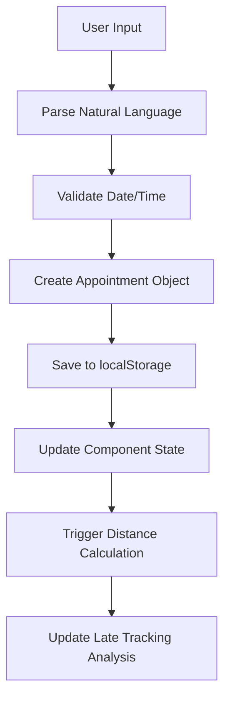

# 🏗️ System Architecture

This document provides a comprehensive overview of the Fleet Tracking System architecture, including component relationships, data flow, and technical decisions.

## 📋 Table of Contents

- [System Overview](#system-overview)
- [Frontend Architecture](#frontend-architecture)
- [State Management](#state-management)
- [API Integration Layer](#api-integration-layer)
- [Data Flow](#data-flow)
- [Component Hierarchy](#component-hierarchy)
- [Service Layer](#service-layer)
- [Performance Considerations](#performance-considerations)
- [Security Architecture](#security-architecture)

## 🌐 System Overview

The Fleet Tracking System is a single-page application (SPA) built with React and TypeScript, designed for real-time fleet monitoring and management.

### High-Level Architecture

```
┌─────────────────────────────────────────────────────────────┐
│                    Frontend (React/TypeScript)              │
├─────────────────────────────────────────────────────────────┤
│  Components Layer                                           │
│  ├── Dashboard Components                                   │
│  ├── Settings Components                                    │
│  └── Delivery Management Components                         │
├─────────────────────────────────────────────────────────────┤
│  State Management Layer                                     │
│  ├── Custom Hooks                                          │
│  ├── Local Storage                                         │
│  └── Context Providers                                     │
├─────────────────────────────────────────────────────────────┤
│  Service Layer                                             │
│  ├── API Services                                          │
│  ├── Business Logic Services                               │
│  └── Utility Services                                      │
├─────────────────────────────────────────────────────────────┤
│  External APIs                                             │
│  ├── Motive API (Vehicle Data)                            │
│  ├── Mapbox API (Geocoding/Routing)                       │
│  └── Optional: HERE/Google Maps                           │
└─────────────────────────────────────────────────────────────┘
```

## 🎨 Frontend Architecture

### Component Structure

The frontend follows a modular component architecture with clear separation of concerns:

```
src/components/
├── Dashboard/              # Main dashboard components
│   ├── StatsCards.tsx     # Fleet statistics display
│   ├── VehicleTable.tsx   # Main vehicle data table
│   ├── DistanceControls.tsx # Distance calculation controls
│   ├── LateTrackingFilter.tsx # Delivery status filtering
│   └── DeliveryStatusDisplay.tsx # Status indicators
├── DeliveryManager/        # Appointment management
│   └── MultipleDeliveryAppointments.tsx
├── Layout/                 # Layout components
│   └── Header.tsx         # Application header
└── Settings/              # Configuration components
    ├── ApiConfigPanel.tsx # API configuration
    └── SystemSettings.tsx # System preferences
```

### Design Patterns

#### 1. Container/Presentational Pattern
```typescript
// Container Component (Smart)
const VehicleTableContainer: React.FC = () => {
  const [vehicles, setVehicles] = useState<Vehicle[]>([]);
  const [loading, setLoading] = useState(false);
  
  // Business logic and state management
  
  return (
    <VehicleTable 
      vehicles={vehicles}
      loading={loading}
      onVehicleSelect={handleVehicleSelect}
    />
  );
};

// Presentational Component (Dumb)
interface VehicleTableProps {
  vehicles: Vehicle[];
  loading: boolean;
  onVehicleSelect: (vehicleId: string) => void;
}

const VehicleTable: React.FC<VehicleTableProps> = ({
  vehicles,
  loading,
  onVehicleSelect
}) => {
  // Pure rendering logic only
  return <div>{/* Render vehicles */}</div>;
};
```

#### 2. Custom Hooks Pattern
```typescript
// Encapsulate complex state logic in custom hooks
const useVehicleData = () => {
  const [vehicles, setVehicles] = useState<Vehicle[]>([]);
  const [loading, setLoading] = useState(false);
  const [error, setError] = useState<string | null>(null);
  
  const fetchVehicles = useCallback(async () => {
    setLoading(true);
    try {
      const data = await motiveApi.getVehicles();
      setVehicles(data);
      setError(null);
    } catch (err) {
      setError(err.message);
    } finally {
      setLoading(false);
    }
  }, []);
  
  return { vehicles, loading, error, fetchVehicles };
};
```

## 🔄 State Management

### Local State Strategy

The application uses a combination of local component state and custom hooks for state management:

```typescript
// App-level state
const App: React.FC = () => {
  const [vehicles, setVehicles] = useLocalStorage<Vehicle[]>('vehicles', []);
  const [appointments, setAppointments] = useState<Record<string, DeliveryAppointment[]>>({});
  
  // Custom hooks for complex state
  const { loadNumbers, setLoadNumber } = useLoadNumbers();
  const { getDistance, calculateAllDistances } = useControlledDistanceCalculation(vehicles, appointments);
  
  return <Dashboard />;
};
```

### State Persistence

```typescript
// Custom hook for localStorage persistence
const useLocalStorage = <T>(key: string, initialValue: T) => {
  const [storedValue, setStoredValue] = useState<T>(() => {
    try {
      const item = window.localStorage.getItem(key);
      return item ? JSON.parse(item, dateReviver) : initialValue;
    } catch (error) {
      console.error(`Error reading localStorage key "${key}":`, error);
      return initialValue;
    }
  });

  const setValue = (value: T | ((val: T) => T)) => {
    try {
      const valueToStore = value instanceof Function ? value(storedValue) : value;
      setStoredValue(valueToStore);
      window.localStorage.setItem(key, JSON.stringify(valueToStore));
    } catch (error) {
      console.error(`Error setting localStorage key "${key}":`, error);
    }
  };

  return [storedValue, setValue] as const;
};
```

## 🔌 API Integration Layer

### Service Architecture

```typescript
// Base API service class
abstract class BaseApiService {
  protected baseUrl: string;
  protected apiKey: string;
  protected rateLimiter: RateLimiter;
  
  constructor(baseUrl: string, apiKey: string) {
    this.baseUrl = baseUrl;
    this.apiKey = apiKey;
    this.rateLimiter = new RateLimiter();
  }
  
  protected async makeRequest<T>(endpoint: string, options?: RequestInit): Promise<T> {
    await this.rateLimiter.waitForSlot();
    
    const response = await fetch(`${this.baseUrl}${endpoint}`, {
      ...options,
      headers: {
        'Authorization': `Bearer ${this.apiKey}`,
        'Content-Type': 'application/json',
        ...options?.headers
      }
    });
    
    if (!response.ok) {
      throw new ApiError(response.status, response.statusText);
    }
    
    return response.json();
  }
}

// Specific API implementations
class MotiveApiService extends BaseApiService {
  async getVehicles(): Promise<Vehicle[]> {
    const data = await this.makeRequest<MotiveVehicleResponse>('/vehicles');
    return this.transformVehicleData(data);
  }
  
  private transformVehicleData(data: MotiveVehicleResponse): Vehicle[] {
    // Transform Motive API response to internal format
  }
}
```

### Error Handling Strategy

```typescript
// Centralized error handling
class ApiError extends Error {
  constructor(
    public statusCode: number,
    public statusText: string,
    public retryable: boolean = false
  ) {
    super(`API Error ${statusCode}: ${statusText}`);
  }
}

// Retry mechanism with exponential backoff
const withRetry = async <T>(
  operation: () => Promise<T>,
  maxRetries: number = 3
): Promise<T> => {
  for (let attempt = 1; attempt <= maxRetries; attempt++) {
    try {
      return await operation();
    } catch (error) {
      if (attempt === maxRetries || !isRetryableError(error)) {
        throw error;
      }
      
      const delay = Math.pow(2, attempt) * 1000;
      await new Promise(resolve => setTimeout(resolve, delay));
    }
  }
  
  throw new Error('Max retries exceeded');
};
```

## 📊 Data Flow

### Vehicle Data Flow

```mermaid
graph TD
    A[Motive API] --> B[motiveApi.getVehicles()]
    B --> C[Data Transformation]
    C --> D[Vehicle State Update]
    D --> E[VehicleTable Component]
    E --> F[Individual Vehicle Rows]
    
    G[User Interaction] --> H[Event Handler]
    H --> I[State Update]
    I --> J[Re-render Components]
```

### Distance Calculation Flow



### Appointment Management Flow



## 🏗️ Component Hierarchy

### Main Application Structure

```
App
├── Header
│   ├── ConnectionStatus
│   ├── LastUpdated
│   └── RefreshButton
├── NavigationTabs
└── MainContent
    ├── Dashboard
    │   ├── DistanceControls
    │   ├── StatsCards
    │   ├── LateTrackingFilter
    │   └── VehicleTable
    │       ├── VehicleRow[]
    │       │   ├── VehicleStatusBadge
    │       │   ├── EditableLoadNumber
    │       │   ├── MultipleDeliveryAppointments
    │       │   ├── DistanceDisplay
    │       │   └── DeliveryStatusDisplay
    │       └── TableControls
    ├── Settings
    │   ├── ApiConfigPanel
    │   └── SystemSettings
    └── DeliveryManager
        └── DeliveryAddressForm
```

### Component Communication

```typescript
// Props drilling for simple data
<VehicleTable 
  vehicles={vehicles}
  onVehicleSelect={handleVehicleSelect}
/>

// Custom hooks for complex state sharing
const useVehicleSelection = () => {
  const [selectedVehicle, setSelectedVehicle] = useState<string | null>(null);
  
  return {
    selectedVehicle,
    selectVehicle: setSelectedVehicle,
    clearSelection: () => setSelectedVehicle(null)
  };
};

// Event-driven communication for loosely coupled components
const eventBus = new EventTarget();

// Publisher
const publishVehicleUpdate = (vehicle: Vehicle) => {
  eventBus.dispatchEvent(new CustomEvent('vehicleUpdate', { detail: vehicle }));
};

// Subscriber
useEffect(() => {
  const handleVehicleUpdate = (event: CustomEvent) => {
    // Handle vehicle update
  };
  
  eventBus.addEventListener('vehicleUpdate', handleVehicleUpdate);
  return () => eventBus.removeEventListener('vehicleUpdate', handleVehicleUpdate);
}, []);
```

## 🛠️ Service Layer

### Business Logic Services

```typescript
// Late tracking analysis service
class LateTrackingService {
  analyzeTruckStatus(
    vehicle: Vehicle,
    appointments: DeliveryAppointment[],
    distance?: DistanceResult
  ): LateTrackingAnalysis {
    const nextAppointment = this.getNextAppointment(appointments);
    
    if (!nextAppointment || !distance) {
      return { status: 'no_data', message: 'Insufficient data' };
    }
    
    const timeUntilAppointment = this.calculateTimeUntil(nextAppointment.datetime);
    const estimatedTravelTime = distance.duration / 60; // Convert to minutes
    const bufferTime = 30; // 30 minutes buffer
    
    if (timeUntilAppointment < 0) {
      return {
        status: 'late',
        message: 'Already past appointment time',
        minutesLate: Math.abs(timeUntilAppointment)
      };
    }
    
    // Additional analysis logic...
  }
}

// Distance calculation management service
class DistanceCalculationManager {
  private cache = new Map<string, CachedDistance>();
  private readonly CACHE_DURATION = 2 * 60 * 60 * 1000; // 2 hours
  
  async calculateDistance(
    from: Coordinates,
    to: Coordinates,
    cacheKey: string
  ): Promise<DistanceResult> {
    // Check cache first
    const cached = this.cache.get(cacheKey);
    if (cached && this.isCacheValid(cached)) {
      return cached.result;
    }
    
    // Calculate new distance
    const result = await mapboxService.calculateDistance(from, to);
    
    // Cache result
    this.cache.set(cacheKey, {
      result,
      timestamp: Date.now(),
      coordinates: from
    });
    
    return result;
  }
  
  private isCacheValid(cached: CachedDistance): boolean {
    return (Date.now() - cached.timestamp) < this.CACHE_DURATION;
  }
}
```

### Utility Services

```typescript
// Date/time utilities
export const dateUtils = {
  formatTimeAgo: (date: Date): string => {
    const now = new Date();
    const diffMs = now.getTime() - date.getTime();
    const diffMins = Math.floor(diffMs / (1000 * 60));
    
    if (diffMins < 1) return 'Just now';
    if (diffMins < 60) return `${diffMins}m ago`;
    
    const diffHours = Math.floor(diffMins / 60);
    return `${diffHours}h ago`;
  },
  
  parseNaturalLanguageDate: (input: string): Date => {
    // Parse formats like "Tomorrow 9AM", "06/16/2025 2PM"
    // Implementation details...
  }
};

// Validation utilities
export const validators = {
  isValidCoordinate: (lat: number, lon: number): boolean => {
    return lat >= -90 && lat <= 90 && lon >= -180 && lon <= 180;
  },
  
  isValidApiKey: (key: string, provider: 'motive' | 'mapbox'): boolean => {
    const patterns = {
      motive: /^[a-zA-Z0-9]{32,}$/,
      mapbox: /^pk\.[a-zA-Z0-9]{50,}$/
    };
    return patterns[provider].test(key);
  }
};
```

## ⚡ Performance Considerations

### Optimization Strategies

#### 1. Component Memoization
```typescript
// Memoize expensive components
const VehicleRow = React.memo<VehicleRowProps>(({ vehicle, onSelect }) => {
  return (
    <tr onClick={() => onSelect(vehicle.id)}>
      {/* Vehicle row content */}
    </tr>
  );
}, (prevProps, nextProps) => {
  // Custom comparison for optimization
  return prevProps.vehicle.id === nextProps.vehicle.id &&
         prevProps.vehicle.lastUpdate === nextProps.vehicle.lastUpdate;
});

// Memoize expensive calculations
const useVehicleStats = (vehicles: Vehicle[]) => {
  return useMemo(() => {
    return {
      total: vehicles.length,
      moving: vehicles.filter(v => v.status === 'moving').length,
      idle: vehicles.filter(v => v.status === 'idle').length
    };
  }, [vehicles]);
};
```

#### 2. Virtual Scrolling for Large Lists
```typescript
// For handling large vehicle lists
const VirtualizedVehicleTable: React.FC<{ vehicles: Vehicle[] }> = ({ vehicles }) => {
  const [visibleRange, setVisibleRange] = useState({ start: 0, end: 50 });
  
  const visibleVehicles = useMemo(() => {
    return vehicles.slice(visibleRange.start, visibleRange.end);
  }, [vehicles, visibleRange]);
  
  return (
    <div className="virtual-table">
      {visibleVehicles.map(vehicle => (
        <VehicleRow key={vehicle.id} vehicle={vehicle} />
      ))}
    </div>
  );
};
```

#### 3. API Request Optimization
```typescript
// Debounced API calls
const useDebouncedApiCall = <T>(
  apiCall: () => Promise<T>,
  delay: number = 300
) => {
  const [data, setData] = useState<T | null>(null);
  const [loading, setLoading] = useState(false);
  
  const debouncedCall = useMemo(
    () => debounce(async () => {
      setLoading(true);
      try {
        const result = await apiCall();
        setData(result);
      } finally {
        setLoading(false);
      }
    }, delay),
    [apiCall, delay]
  );
  
  return { data, loading, call: debouncedCall };
};
```

## 🔒 Security Architecture

### API Security

```typescript
// Secure API key management
const getApiConfig = (): ApiConfig => {
  const config = {
    motiveApiKey: import.meta.env.VITE_MOTIVE_API_KEY,
    mapboxToken: import.meta.env.VITE_MAPBOX_ACCESS_TOKEN
  };
  
  // Validate API keys are present
  if (!config.motiveApiKey || !config.mapboxToken) {
    throw new Error('Missing required API keys');
  }
  
  return config;
};

// Request sanitization
const sanitizeApiRequest = (data: any): any => {
  // Remove sensitive fields
  const sanitized = { ...data };
  delete sanitized.apiKey;
  delete sanitized.password;
  delete sanitized.token;
  
  return sanitized;
};
```

### Data Protection

```typescript
// Encrypt sensitive data in localStorage
const secureStorage = {
  setItem: (key: string, value: any): void => {
    const encrypted = btoa(JSON.stringify(value));
    localStorage.setItem(key, encrypted);
  },
  
  getItem: <T>(key: string): T | null => {
    try {
      const encrypted = localStorage.getItem(key);
      if (!encrypted) return null;
      
      const decrypted = atob(encrypted);
      return JSON.parse(decrypted);
    } catch {
      return null;
    }
  }
};
```

### Content Security Policy

```typescript
// CSP configuration for production
const cspDirectives = {
  'default-src': ["'self'"],
  'script-src': ["'self'", "'unsafe-inline'"],
  'style-src': ["'self'", "'unsafe-inline'"],
  'img-src': ["'self'", "data:", "https:"],
  'connect-src': [
    "'self'",
    "https://api.gomotive.com",
    "https://api.mapbox.com"
  ],
  'font-src': ["'self'"],
  'object-src': ["'none'"],
  'base-uri': ["'self'"],
  'form-action': ["'self'"]
};
```

---

This architecture provides a solid foundation for the Fleet Tracking System, ensuring scalability, maintainability, and performance while following React and TypeScript best practices.